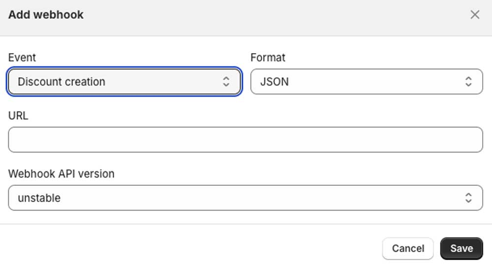

# Suavecito Discount Update

> An AWS Lambda powered by Serverless. The lambda is used to create / update Shopify discounts.

Use Case:

- Update discounts created by 3rd party apps (ex: Klaviyo, Smile). These 3rd Party apps sometimes do not have combinable discount settings.

## Setup

Create a Shopify `Discount Creation` Webhook

- Add the lambdas deployed url as the url
- Set API Version to latest

<p align="center">
  
</p>

### Environmental Variables

You find the Webhook Secret in /settings/notifications/webhooks

```bash
WEBHOOK_SECRET=
SHOPIFY_ADMIN_API_VERSION=2024-07
SHOPIFY_STORE=suavecito
SHOPIFY_ACCESS_TOKEN=
```
